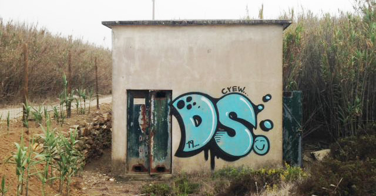

# Data Science
Repository for Data Science class at Institute Superior Técnico.

**deadline** - November 22nd (23:59)

##### Report:
> https://docs.google.com/document/d/1ckBNcoYm2KDTkK0Ytd3hv51d0GjNczayprSZeywLYeA/edit?usp=sharing
> https://www.overleaf.com/8773489724htkzvcqskysp


##### Course page:
>[https://fenix.tecnico.ulisboa.pt/disciplinas/CDadosi7/2019-2020/1-semestre](https://fenix.tecnico.ulisboa.pt/disciplinas/CDadosi7/2019-2020/1-semestre)




## Delivery
- submit into Fenix system
- report + code

## Methodology
Information discovery on both datasets must be done using essential exploratory data analysis, preprocessing techniques (data transformations to facilitate the learning and or handle specific data aspects such as semi-structured data, high-dimensionality, missings, non-i.i.d. attributes or imbalanced classes), unsupervised techniques (pattern mining and clustering), and classification techniques, including naïve Bayes, kNN, decision trees, random forests and XGBoost.
Students may choose the mining tool to apply, between python (using scikit-learn) and R.

## Guidelines

### Description
The students should perform a statistical analysis of the datasets in advance and summarize relevant implications in the report, such as the underlying distributions and hypothesized forms feature dependency.
Preprocessing

In accordance with the properties of the input dataset and the behavior of the target learning algorithm, the students are allowed to apply preprocessing techniques when needed or under a solid conjecture of its potential impact on learning.

### Unsupervised Learning
Unsupervised exploration must be done through clustering and association rule mining. Class attributes should not be used to explore the data, unless there is a well substantiated interest for mining class- conditional data or discovering association rules with classes in the antecedent/consequent. Nevertheless, class attributes may be used to objectively assess clustering results and evaluate the discriminative power of certain association rules. Besides this, statistical evaluation must be performed using the studied indexes.

### Classification
Supervised exploration must be done via the application of kNN, Naïve Bayes, Decision Trees, Random Forests and XGBoost. For this purpose, the use of class attributes is mandatory. Evaluation of the obtained models should be done as usual, through accuracy measures and evaluation charts, as studied in the classes. A thorough comparison of the adequacy of the models should be present taking into consideration the adequacy of their behavior against the properties of each dataset and their observed performance.

### Excellence
A project that applies the suggested data mining techniques over the given datasets and provides a clear and sound analysis of the collected results is not necessarily an excelling project.

Excelling projects have four major characteristics.
First, they show an acute understanding of the data characteristics and their impact on the learning. Excelling projects formulate hypothesis behind differences in performance.

Second, they have precise and succinct language: no redundancies, unnecessary or subjective statements. 

Third, excelling projects are often a result of a creative thinking on ways of improving the learning. Illustrating, the justified use of a specific preprocessing technique (whether the inclusion of new features, space transformations, handling of outliers or specific forms of noise) can make a difference.

Fourth, robust assessments go beyond simple performance indicators. Excelling projects draw (parameter- varying) plots, test hypotheses, and establish ratios to understand less-trivial performance views such as robustness to noise, domain adequacy or overfitting propensity.

## Grading 
- **report** (90%)
    - follow the template and structure given
    - without any cover page
    - 8 pages including any appendix
    - should describe
        - the placed choices
        - pre-processing performed 
        - applied parameterizations
        - found results, their interpretation and critical analysis for each dataset
        - comparison of the results achieved in both problems
        - relation among the information discovered through the different techniques
- **functional project** (10%)
    - python project or R project that automatically returns relevant results in the presence of new data instances from one of the two given datasets
    - should be able to read from the input console
        - the number of lines to read
        - the name of the dataset: PD|CT
        - task: preprocessing|unsupervised|classification where preprocessing option should return in the output console up to 100 lines of statistics comparing the adequacy of different preprocessing techniques, the unsupervised option should produce up to 100 lines of statistics on the found clusters and patterns; and classification option should return up to 200 lines of statistics comparing the classifiers’ performance (including a confusion matrix per classifier) using a 10-fold cross validation

```
INPUT CONSOLE
100 CT classification Elevation,Aspect,Slope,Horizontal_Distance_To_Hydrology, [...], Cover_Type 
2596,51,3,258,0,510,221,232,148,6279,1,0,0,0,0,0,0,0,0,0, [...], 5
[...]

OUTPUT CONSOLE
1. Applied preprocessing: <...>
2. Classifiers:
2.1 NB
a) Suggested parameterization: <...>
b) Confusion matrix: <...>
# performance improvements against default preprocessing and parameterization can be included 2.2 <...>
3. Comparative performance: NB | kNN | DT | RF
3.1 Accuracy: 0.76 | 0.81 | 0.56 | 0.90
3.2 Sensitivity: <...>
<...>
```

>External libraries (other than scikit-learn, pandas, scipy, numpy, matplotlib) should be explicitly included in the project within a folder imports.

## Evaluation criteria
1. Statistical description (5%) 
1. Preprocessing (20%)
1. Unsupervised (15%)
    - Association Rules (7.5%)
    - Clustering (7.5%) 
1. Classification (20%)
    - Naïve Bayes (2%)
    - Instance-based Learning (3%) 
    - Decision Trees (5%)
    - Random Forests (5%)
    - XGBoost (5%)
1. Evaluation and critical analysis (30%)
1. Creativity (10%)

